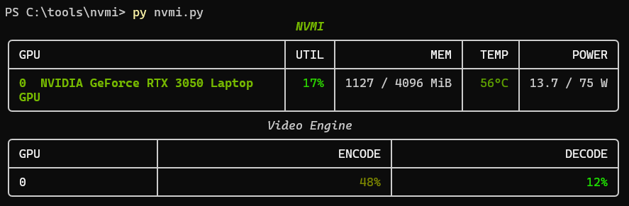

# NVMI 

A Open Source - lightweight real-time NVIDIA GPU monitor written in Python. / Software ringan real-time untuk Monitoring NVIDIA GPU menggunakan Python



## Features
- Live GPU utilization
- Memory usage
- Temperature
- Power draw
- Single-box live UI (nvidia-smi style)

## Requirements
- NVIDIA GPU
- NVIDIA drivers

## Install
```bash
pip install -r requirements.txt
